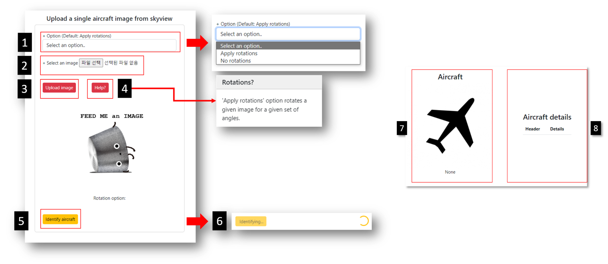

# Fighter aircrafts classifer using Django backend
This is a simple fighter aircrafts classfier made with convolutional neural networks. 
The CNN model itself is a pre-trained InceptionV3 architecture, 
and is used for transfer learning of custom dataset in this project.

The custom dataset is called MTARSI(Multi-type Aircraft of Remote Sensing Images),
and you can download via following link if necessary.
https://zenodo.org/record/5044950#.YsZY_2DP2Uk

Whilst this is mainly a deep learning project,
the project is intended to remind myself how to design a backend and a simple frontend(bootstrap) with a deep learning model. 

You can also refer to colab notebook files in the project folder if you want to know how the training was done.

## So what is it exactly?
It is a CNN model that identifies 42 models of fighter aircrafts that runs on your web browser, 
and it uses Django backend to handle input and output data from the tensorflow model. 

* You can only classify a single aircraft at a time.
* Only top-view images like satelite imagery are valid as input data.
* You can simply crop images of aircrafts from imagery sources like Google Maps or Google Earth.
* The backend will try to retrieve identified aircraft details from Wikipedia.

## How to use

* Download pretrained CNN model(InceptionV3) with MTARSI dataset from following link:
https://drive.google.com/drive/folders/1Io_eTAVVlj0fsYXTD7vkVRw4ATlliqR5?usp=sharing

place TF-MODEL folder in the main directory of the project folder.

* To run this project, simply run following commands in terminal in the main project folder.
```
$ python manage.py runserver
```

* Required libraries can be installed with following command.
```
$ pip install -r requirements.txt
```

* The frontend looks like this:


### 1. Select option: 
-Options lets you to decide whether to feed rotated images to
the CNN model. With rotated images, the CNN model could
output results that varies in aircraft model. The majority of the output
will be recognized as actual, and valid output.

### 2. Select image
-Select your own aircraft satelite imagery.

### 3. Upload image
-Upload selected image.

### 5. Identify image
-Identify uploaded image. This might take a while
as the backend will try to retrieve identified aircraft details
from Wikipedia. 

### 7. Aircraft image
-This section will display identified aircraft image
from Wikipedia.

### 8. Details
-This section will display details of the 
identified aircraft from Wikipedia.


